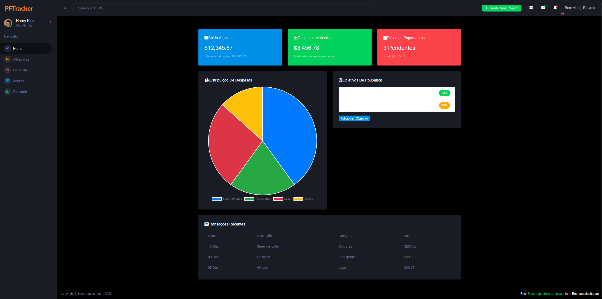

# 💰 PFTracker – Personal Finance Tracker

### 🎓 Academic Project

---

## 🧭 Objective

The **PFTracker – Personal Finance Tracker** purpose is to create a financial control system wich allows the user to manage their personal finances, recording incomes and expenses, and classifying transactions for posterior analysis.

---

## 🧑‍🤝‍🧑 Dev Team

| Name |
|------|
| Diogo Louro
| Ricardo Conceição

---

## ⚙️ Main Features

✅ **User registration and authentication** with email activation
✅ **Financial transaction management** (recording, editing, and removing income/expenses)  
✅ **Creation of savings goals**  
✅ **Classification and categorization of expenses**  
✅ **Dynamic financial reports and graphs**  
✅ **Responsive and intuitive design**, adapted to different devices 

---

## 🗃️ Tech Stack

- **Language:** C#  
- **Framework:** ASP.NET WebForms  
- **Database:** Microsoft SQL Server  
- **Styles:** Bootstrap  
- **Development Tools:** Visual Studio, Git, GitHub 

---

## 🖥️ Demo

📸 Example: login page, dashboard, transaction form. 

  
  
  
  
  
  

---

## 📬 Contact
📧 **dblouro@outlook.com** 

If you would like to know more about the project: 
🔗 [GitHub: dblouro](https://github.com/dblouro) 
🔗 [GitHub: runniOp](https://github.com/runniOp)

---

> “Financial organization is the first step towards personal freedom.”  
> — PFTracker Team 💡
